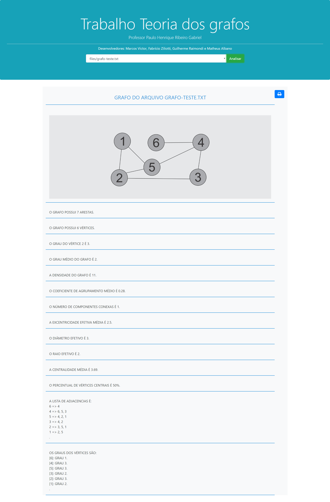

# graph-analysis (december 2018)
Final work developed for the discipline Teoria dos Grafos in the graduation. 

This work was developed to obtain information about graphs of large complex networks, through functions that extract information from such graphs as number of vertices, edges, components, average degree, density, etc.

Print screen:

Credits to my group mates: Guilherme Raimondi, Matheus Albano and Marcos Victor.
